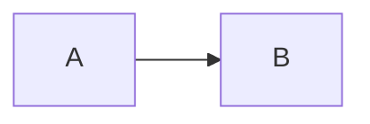

```mermaid
graph LR
    A --> B
```

```mermaid
graph LR
    Client["Client"]
    Uvicorn["Uvicorn Server"]
    FastAPI["FastAPI Application"]
    Routes["Route Handlers"]
    CRUD["CRUD Operations"]
    SQLAlchemy["SQLAlchemy ORM"]
    Database["SQL Server Database"]
    
    Client -->|HTTP Request| Uvicorn
    Uvicorn -->|Route| FastAPI
    FastAPI -->|Dispatch| Routes
    Routes -->|Query/Mutate| CRUD
    CRUD -->|Generate SQL| SQLAlchemy
    SQLAlchemy -->|ODBC/aioodbc| Database
    Database -->|Result| SQLAlchemy
    SQLAlchemy -->|ORM Objects| CRUD
    CRUD -->|Data| Routes
    Routes -->|Pydantic Schema| FastAPI
    FastAPI -->|JSON Response| Uvicorn
    Uvicorn -->|HTTP Response| Client
```